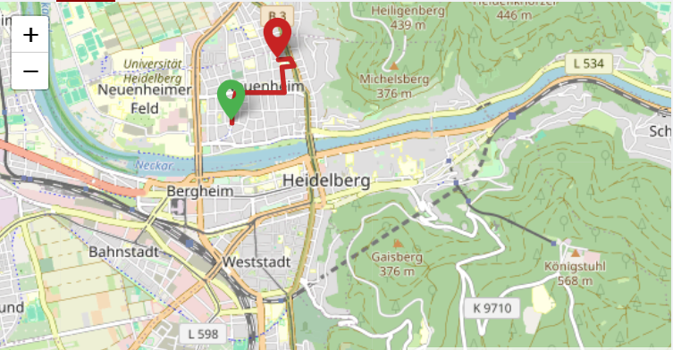

# Road Route Mapping Project

This project generates an interactive map that displays the actual road route between two towns using API data. The map is rendered using `folium` and highlights the road between the two user-defined towns with markers indicating the start and end points.

## Features
- Interactive map with zoom and pan functionality
- Automatically plots the actual road route between two towns
- Markers indicating the start and end towns
- Road path highlighted in blue with configurable color, weight, and opacity

## Technologies Used
- **Python**: Main programming language used.
- **Folium**: A Python library used to generate interactive maps.
- **Requests**: For API calls to fetch coordinates and route data.
- **OpenStreetMap/Leaflet.js**: For rendering the map tiles and geographic data.

## Prerequisites

Before running this project, ensure you have the following:

- Python 3.x installed on your machine
- API key(s) for the geocoding and routing service you're using (e.g., OpenStreetMap, Google Maps API, etc.)

### Python Libraries

Install the required libraries by running:

```bash
pip install folium requests
```

## Installation

1. **Clone the repository**:

   ```bash
   [git clone https://github.com/your-username/road-route-mapping.git]
   ```

2. **Navigate to the project directory**:

   ```bash
   cd road-route-mapping
   ```

3. **Install the required dependencies**:

   ```bash
   pip install -r requirements.txt
   ```

## Usage

1. **Run the script**:

   To start the project, simply run the Python script:

   ```bash
   python road_route_map.py
   ```

2. **Enter town names**:

   You will be prompted to input the names of the start and end towns. Example:

   ```bash
   Enter start point: Nairobi
   Enter end point: Mombasa
   ```

3. **Generated Map**:

   Once the script finishes, an HTML file (`route_map.html`) will be generated in the project directory. Open the file in your browser to see the map with the road route highlighted.

## Example

Here is an example of how the map will look:

- A blue path connects the two towns (e.g., Nairobi to Mombasa), and markers indicate the start (green) and end (red) locations.
  


## Project Structure

```
├── road_route_map.py        # Main Python script
├── README.md                # Project documentation (this file)
├── requirements.txt         # Python dependencies
└── route_map.html           # Generated map output (created after running the script)
```

## API Integration

The project integrates with a geocoding and routing API to fetch coordinates for the towns and to get the road route between them. You need to replace the placeholder API URLs in the code with your actual API provider.

## Future Improvements

- Add support for more customization (e.g., different polyline styles, marker customization).
- Include the ability to save multiple routes or compare routes.
- Add support for additional information like distance, duration, and route elevation.


